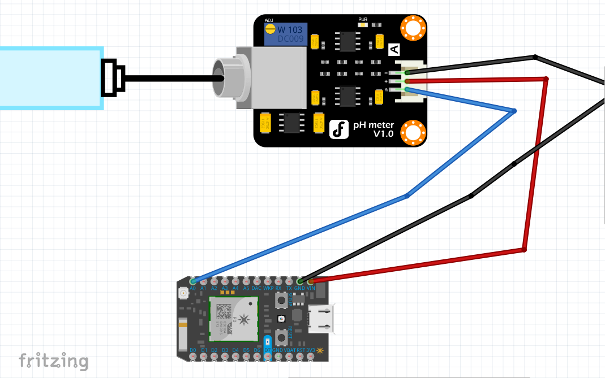
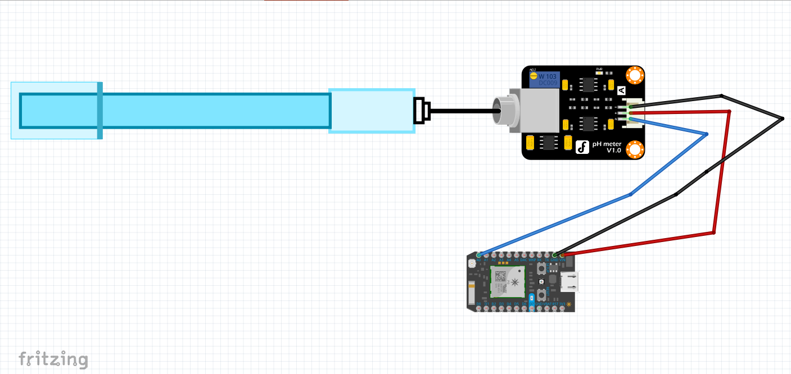

# Sensor setup
The pH sensor that I used was from DF Robot. It comes with a decent amount of documentation of its own, but it meant for Arduino. To set it up with Particle Photon is not very different, however, the callibration is. To set it up, use electrical wires to connect the sensor in to the Photon using this electrical diagram.

